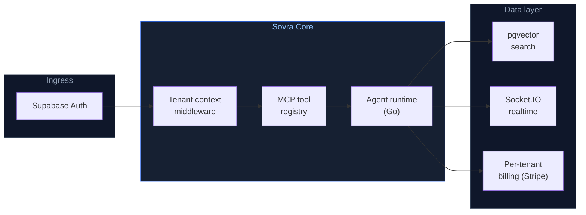

<div align="center">

<svg xmlns="http://www.w3.org/2000/svg" viewBox="0 0 800 160" width="800" height="160" role="img" aria-label="Sovra — Open-source multi-tenant AI infrastructure">
  <defs>
    <linearGradient id="bg" x1="0%" y1="0%" x2="100%" y2="100%">
      <stop offset="0%" stop-color="#0F172A"/>
      <stop offset="100%" stop-color="#1E293B"/>
    </linearGradient>
    <linearGradient id="accent" x1="0%" y1="0%" x2="100%" y2="0%">
      <stop offset="0%" stop-color="#2563EB"/>
      <stop offset="100%" stop-color="#5B7C99"/>
    </linearGradient>
    <linearGradient id="mark" x1="0%" y1="0%" x2="100%" y2="100%">
      <stop offset="0%" stop-color="#5B7C99"/>
      <stop offset="100%" stop-color="#2F4858"/>
    </linearGradient>
  </defs>
  <rect width="800" height="160" rx="12" fill="url(#bg)"/>
  <line x1="0" y1="53" x2="800" y2="53" stroke="#ffffff" stroke-opacity="0.03" stroke-width="1"/>
  <line x1="0" y1="107" x2="800" y2="107" stroke="#ffffff" stroke-opacity="0.03" stroke-width="1"/>
  <line x1="200" y1="0" x2="200" y2="160" stroke="#ffffff" stroke-opacity="0.03" stroke-width="1"/>
  <line x1="400" y1="0" x2="400" y2="160" stroke="#ffffff" stroke-opacity="0.03" stroke-width="1"/>
  <line x1="600" y1="0" x2="600" y2="160" stroke="#ffffff" stroke-opacity="0.03" stroke-width="1"/>
  <rect x="36" y="52" width="56" height="56" rx="8" fill="#0F172A" stroke="#2563EB" stroke-width="1" stroke-opacity="0.4"/>
  <path d="M70 64a11 9 0 0 0-10-5H52a8 6 0 0 0 0 12h4v-4H52a2 2 0 0 1 0-4h8a7 5 0 0 1 7 4z" fill="url(#mark)"/>
  <path d="M54 76h20a6 5 0 0 1 0 9H54v-3h20a2 2 0 0 0 0-3H54z" fill="url(#mark)" opacity="0.75"/>
  <path d="M52 93a8 7 0 0 0 9 5h7a8 7 0 0 0 7-10h-4a4 3 0 0 1-3 6H60a6 5 0 0 1-5-3z" fill="url(#mark)" opacity="0.55"/>
  <text x="108" y="95" font-family="ui-monospace,SFMono-Regular,Menlo,Monaco,Consolas,monospace" font-size="42" font-weight="700" letter-spacing="-1" fill="#F8FAFC">sovra</text>
  <rect x="108" y="103" width="148" height="3" rx="1.5" fill="url(#accent)"/>
  <text x="108" y="126" font-family="-apple-system,BlinkMacSystemFont,'Segoe UI',sans-serif" font-size="13" fill="#94A3B8" letter-spacing="0.2">Open-source multi-tenant infrastructure for AI products</text>
  <rect x="430" y="42" width="60" height="22" rx="11" fill="#1E3A5F" stroke="#2563EB" stroke-width="0.75" stroke-opacity="0.6"/>
  <text x="460" y="57" font-family="-apple-system,BlinkMacSystemFont,'Segoe UI',sans-serif" font-size="10" font-weight="600" fill="#93C5FD" text-anchor="middle">Auth</text>
  <rect x="500" y="42" width="60" height="22" rx="11" fill="#1E3A5F" stroke="#2563EB" stroke-width="0.75" stroke-opacity="0.6"/>
  <text x="530" y="57" font-family="-apple-system,BlinkMacSystemFont,'Segoe UI',sans-serif" font-size="10" font-weight="600" fill="#93C5FD" text-anchor="middle">Billing</text>
  <rect x="570" y="42" width="60" height="22" rx="11" fill="#1E3A5F" stroke="#2563EB" stroke-width="0.75" stroke-opacity="0.6"/>
  <text x="600" y="57" font-family="-apple-system,BlinkMacSystemFont,'Segoe UI',sans-serif" font-size="10" font-weight="600" fill="#93C5FD" text-anchor="middle">MCP</text>
  <rect x="640" y="42" width="72" height="22" rx="11" fill="#1E3A5F" stroke="#2563EB" stroke-width="0.75" stroke-opacity="0.6"/>
  <text x="676" y="57" font-family="-apple-system,BlinkMacSystemFont,'Segoe UI',sans-serif" font-size="10" font-weight="600" fill="#93C5FD" text-anchor="middle">pgvector</text>
  <rect x="430" y="80" width="64" height="28" rx="6" fill="#0F172A" stroke="#334155" stroke-width="1"/>
  <text x="462" y="99" font-family="ui-monospace,SFMono-Regular,Menlo,Monaco,Consolas,monospace" font-size="9" fill="#64748B" text-anchor="middle">Tenant</text>
  <line x1="494" y1="94" x2="510" y2="94" stroke="#2563EB" stroke-width="1.5" stroke-opacity="0.7"/>
  <polygon points="510,91 516,94 510,97" fill="#2563EB" opacity="0.7"/>
  <rect x="516" y="80" width="64" height="28" rx="6" fill="#0F172A" stroke="#334155" stroke-width="1"/>
  <text x="548" y="99" font-family="ui-monospace,SFMono-Regular,Menlo,Monaco,Consolas,monospace" font-size="9" fill="#64748B" text-anchor="middle">MCP Tools</text>
  <line x1="580" y1="94" x2="596" y2="94" stroke="#2563EB" stroke-width="1.5" stroke-opacity="0.7"/>
  <polygon points="596,91 602,94 596,97" fill="#2563EB" opacity="0.7"/>
  <rect x="602" y="80" width="78" height="28" rx="6" fill="#162032" stroke="#2563EB" stroke-width="1" stroke-opacity="0.5"/>
  <text x="641" y="99" font-family="ui-monospace,SFMono-Regular,Menlo,Monaco,Consolas,monospace" font-size="9" fill="#93C5FD" text-anchor="middle">Go Runtime</text>
  <rect x="692" y="130" width="72" height="18" rx="9" fill="#1E293B"/>
  <text x="728" y="143" font-family="-apple-system,BlinkMacSystemFont,'Segoe UI',sans-serif" font-size="9.5" font-weight="600" fill="#4ADE80" text-anchor="middle">MIT License</text>
</svg>

<br/>

[](https://github.com/byteworthyllc/sovra/actions)
[](./LICENSE)
[](https://go.dev)
[](https://www.typescriptlang.org)
[](https://discord.gg/byteworthy)
[](./CONTRIBUTING.md)

**[Try the demo →](https://byteworthy.io/sovra?utm_source=github&utm_medium=readme&utm_campaign=sovra&utm_content=hero-cta)** &nbsp;·&nbsp; [Read the docs](https://byteworthy.io/sovra/docs?utm_source=github&utm_medium=readme&utm_campaign=sovra&utm_content=hero-docs) &nbsp;·&nbsp; [Self-host →](#quick-start) &nbsp;·&nbsp; [Cloud waitlist →](https://byteworthy.io/sovra/managed)

</div>

> [!NOTE]
> **Public beta.** Sovra is the open-source foundation underneath the ByteWorthy boilerplate family ([Klienta](https://github.com/ByteWorthyLLC/klienta), [Clynova](https://github.com/ByteWorthyLLC/clynova)). Self-host freely under MIT. [Star to follow releases](https://github.com/ByteWorthyLLC/sovra) or [join the Discord](https://discord.gg/byteworthy).

---

**Sovra** is open-source multi-tenant infrastructure for AI products. Instead of assembling Auth0 + Stripe + a vector DB + custom MCP glue, it bundles auth, billing, an MCP tool registry, pgvector search, and real-time collaboration as one coherent platform.

> **The goal is simple:** ship the AI features that differentiate your product — not the platform plumbing every AI app rebuilds.

## Quick Start

```bash
# Clone the platform
git clone https://github.com/byteworthyllc/sovra.git
cd sovra

# Install dependencies (pnpm + go modules)
pnpm install
go mod download

# Configure environment (Supabase + Stripe + Anthropic / OpenAI keys)
cp .env.example .env.local

# Initialize tenant schema + pgvector + MCP registry
pnpm db:push

# Run platform (Next.js + Go services)
pnpm dev
```

Open `http://localhost:3000` for the admin. Create your first tenant. Add your first MCP tool. Build agents.

[Self-host guide →](https://byteworthy.io/sovra/docs/self-host?utm_source=github&utm_medium=readme&utm_content=quickstart-link) · [Managed (waitlist) →](https://byteworthy.io/sovra/managed?utm_source=github&utm_medium=readme&utm_content=managed-waitlist)

## How it works



Sovra composes the seven layers most AI products rebuild from scratch:

1. **Auth** — Supabase Auth with tenant context propagation
2. **Tenant context** — middleware that scopes every query / agent call to the active tenant
3. **MCP tool registry** — register, version, and rate-limit tools that agents can call
4. **Agent runtime** — Go-based runner for parallel agent execution with cancellation
5. **Vector search** — pgvector with per-tenant collections and namespaces
6. **Real-time** — Socket.IO for live agent state + collaborative cursors
7. **Per-tenant billing** — Stripe usage metering keyed to tenant + tool

### What it looks like

Register an MCP tool — Sovra handles tenant scoping, rate limits, and billing automatically:

```ts
import { sovra } from "@byteworthy/sovra";

await sovra.tools.register({
  name: "search-knowledge-base",
  schema: {
    input:  { query: z.string() },
    output: { results: z.array(z.object({ title: z.string(), url: z.string() })) },
  },
  handler: async (ctx, { query }) => {
    // ctx.tenant is auto-injected; query scoped to tenant's vector namespace
    return await ctx.vectors.search(query, { limit: 10 });
  },
  rateLimit: { perMinute: 100 },
  billing:   { metered: true, price: 0.01 },
});
```

Run an agent that uses the tool:

```ts
const result = await sovra.agents.run({
  agentId: "agent_research",
  input:   "Summarize our Q3 product launches",
  // tenant context auto-propagated; tool calls billed to this tenant
});

// result.toolCalls === [{ name: "search-knowledge-base", duration: 124, billed: 0.01 }]
```

## Why this exists for AI product builders

AI products repeatedly rebuild the same plumbing: tenant scoping, agent state, tool registry, vector search, billing. Each rebuild takes 6–8 weeks before any user-facing feature ships.

Sovra is the foundation that ships those seven layers solved, so engineering time goes to the features that differentiate the product.

> The tradeoff: you don't get to "build it your way" for the boring parts. You get to ship the parts that actually differentiate your product.

## Sovra vs the alternatives

|  | **Sovra** | Auth0 + Stripe + Pinecone + glue | Build from scratch |
|---|---|---|---|
| Vendors to manage | **1** | 4+ | many |
| Multi-tenant context propagation | ✅ built-in | ⚠️ requires custom | ⚠️ requires custom |
| MCP tool registry | ✅ | ❌ | ⚠️ requires custom |
| Vector search | pgvector built-in | Pinecone (separate billing) | depends |
| Self-hosted | ✅ | partially | ✅ |
| Open source | ✅ MIT | ❌ | ✅ (yours) |
| Real-time agent state | Socket.IO | ⚠️ requires custom | ⚠️ requires custom |
| Per-tenant billing | ✅ | ⚠️ requires Stripe wiring | ⚠️ requires custom |

## Pricing

Sovra core is **open source under MIT** — self-host freely.

| Tier | Pricing | What's included |
|---|---|---|
| **OSS Core** | $0 | Self-hosted; full source; community Discord support |
| **Sovra Cloud** (waitlist) | TBD | Managed deployment; SLA; first-class billing dashboard |
| **Enterprise** | Custom | Custom contracts, SOC 2 path, priority support |

[Join Cloud waitlist →](https://byteworthy.io/sovra/managed?utm_source=github&utm_medium=readme&utm_content=cloud-waitlist) · [**Book a call →**](https://byteworthy.io/book?utm_source=github&utm_medium=readme&utm_campaign=sovra&utm_content=mid-call)

## Use cases

<details><summary><b>Multi-tenant SaaS with AI features</b></summary>

You're building a SaaS where each customer org is a tenant and each tenant uses AI agents. Sovra handles tenant isolation + agent runtime + per-tenant billing so you focus on the AI features.

</details>

<details><summary><b>Vertical AI product launching beta</b></summary>

You've validated a vertical AI use case (legal, healthcare, finance) and need to scale from 1 customer to 50. Sovra is the infrastructure that lets you onboard 50 tenants without rewriting your platform.

</details>

<details><summary><b>AI startup post-prototype, pre-Series A</b></summary>

The prototype works. Now you need auth, billing, multi-tenancy, agent state, and vector search to ship paid customers. Sovra replaces 6–8 weeks of platform work.

</details>

## Stack

`Next.js 16` · `React 19` · `TypeScript` · `Supabase (Postgres + RLS + Auth)` · `pgvector` · `Go 1.22+` · `Model Context Protocol` · `Vercel AI SDK (Anthropic + OpenAI)` · `Socket.IO` · `Stripe` · `Tailwind CSS` · `shadcn/ui` · `Sentry` · `PostHog` · `Upstash Redis`

## Roadmap

See the [public roadmap](https://github.com/byteworthyllc/sovra/projects/1).

Recent releases:

- **v0.6** — MCP tool versioning + rollback
- **v0.5** — pgvector per-tenant namespaces
- **v0.4** — Real-time agent state via Socket.IO
- **v0.3** — Multi-tenant Stripe billing wired
- **v0.2** — Auth + RLS hardened
- **v0.1** — initial public release

## FAQ

<details><summary><b>What is Sovra?</b></summary>

Sovra is open-source multi-tenant infrastructure for AI products. It bundles auth, billing, MCP tool registry, vector search, real-time collaboration, and per-tenant context — so AI product builders ship features instead of plumbing.

</details>

<details><summary><b>Who is Sovra for?</b></summary>

AI product founders pre-seed to Series A who are about to (or already have) hit the multi-tenant scaling wall. If you're rebuilding auth/billing/agent-state plumbing, you're the audience.

</details>

<details><summary><b>How does Sovra compare to Auth0, Stripe, Pinecone, and custom MCP glue?</b></summary>

Those are four separate vendors to integrate, bill, and maintain. Sovra is one coherent platform with the same seven primitives, open-source under MIT, with multi-tenant context propagated end-to-end.

</details>

<details><summary><b>Is Sovra open source?</b></summary>

Yes — MIT license. Self-host freely. The managed Sovra Cloud (waitlist) is the optional paid tier.

</details>

<details><summary><b>What's MCP and why does Sovra use it?</b></summary>

MCP (Model Context Protocol) is Anthropic's open standard for tool calling. Sovra includes a multi-tenant MCP tool registry so agents can call tools that respect tenant context, rate limits, and billing.

</details>

<details><summary><b>Does Sovra work without Supabase?</b></summary>

The default stack is Supabase. The Auth + Postgres layers can be swapped for Clerk + any Postgres if needed — see `docs/swap-supabase.md`.

</details>

<details><summary><b>Does Sovra support Anthropic, OpenAI, and other LLM providers?</b></summary>

Yes — the agent runtime is provider-agnostic. Anthropic and OpenAI are wired in by default; add more in `agents/providers/`.

</details>

<details><summary><b>Can I run Sovra without Go?</b></summary>

The agent runtime is in Go for parallel execution + cancellation. The rest of Sovra is TypeScript. If you don't want Go, the runtime can be swapped for a Node.js worker pool — see `docs/replace-runtime.md`.

</details>

## Community

- → **[Discord](https://discord.gg/byteworthy)** — design chat, releases, support
- → **[GitHub Discussions](https://github.com/ByteWorthyLLC/sovra/discussions)** — questions and design proposals
- → **[GitHub Issues](https://github.com/ByteWorthyLLC/sovra/issues)** — bug reports and feature requests
- → **[Newsletter](https://byteworthy.io/newsletter)** — release notes by email
- → **[@byteworthyllc](https://twitter.com/byteworthyllc)** — release-day pings

## Documentation

Production-readiness, security, and operational docs:

- [Release process](./docs/release-process.md) — release workflow + version-bump policy
- [Auth framework](./docs/auth-framework.md) — tenant context propagation + RLS hardening
- [Hugging Face integration](./docs/huggingface-integration.md) — model loading + caching
- [Premium benchmark](./docs/premium-benchmark.md) — performance characteristics by tier
- [Operations runbook](./docs/operations-runbook.md) — incident response procedures
- [Production readiness](./docs/production-readiness.md) — go-live checklist
- [Security policy](./SECURITY.md) — vulnerability disclosure
- [Support](./SUPPORT.md) — how to get help

## Contributing

PRs welcome. See [`CONTRIBUTING.md`](./CONTRIBUTING.md). All commits require DCO sign-off (Sovra is GitOps-clean).

## Security

Found a security issue? Email security@byteworthy.io. See [`SECURITY.md`](./SECURITY.md).

## License

MIT — see [`LICENSE`](./LICENSE).

<details>
<summary>Structured data (JSON-LD for AI engines)</summary>

```json
{
  "@context": "https://schema.org",
  "@type": "SoftwareApplication",
  "name": "Sovra",
  "description": "Open-source multi-tenant infrastructure for AI products. Auth, billing, MCP tools, pgvector search.",
  "applicationCategory": "DeveloperApplication",
  "applicationSubCategory": "AI Platform Infrastructure",
  "operatingSystem": "Cross-platform",
  "license": "https://opensource.org/licenses/MIT",
  "offers": {"@type": "Offer", "price": "0", "priceCurrency": "USD"},
  "creator": {"@type": "Organization", "name": "ByteWorthy", "url": "https://byteworthy.io"},
  "url": "https://byteworthy.io/sovra",
  "softwareVersion": "1.0",
  "featureList": ["Multi-tenant auth","MCP tool registry","pgvector search","Per-tenant billing","Real-time agent state","Go agent runtime"],
  "programmingLanguage": ["TypeScript","Go"],
  "audience": {"@type": "BusinessAudience", "audienceType": "AI product founders, AI infrastructure teams"}
}
```

</details>

---

<div align="center">

**The ByteWorthy boilerplate family** (same multi-tenant lineage):<br/>
**[Sovra](https://github.com/ByteWorthyLLC/sovra)** *(this repo, MIT)* &nbsp;·&nbsp; [Klienta](https://github.com/ByteWorthyLLC/klienta) *(commercial — agency portals)* &nbsp;·&nbsp; [Clynova](https://github.com/ByteWorthyLLC/clynova) *(commercial — HIPAA-ready healthcare)*

**Open-source companions:**<br/>
[honeypot-med](https://github.com/ByteWorthyLLC/honeypot-med) &nbsp;·&nbsp; [byteworthy-defend](https://github.com/ByteWorthyLLC/byteworthy-defend) &nbsp;·&nbsp; [vqol](https://github.com/ByteWorthyLLC/vqol) &nbsp;·&nbsp; [hightimized](https://github.com/ByteWorthyLLC/hightimized) &nbsp;·&nbsp; [outbreaktinder](https://github.com/ByteWorthyLLC/outbreaktinder)

[**Self-host Sovra →**](#quick-start) &nbsp;·&nbsp; [**Sovra Cloud waitlist →**](https://byteworthy.io/sovra/managed)

Built by [ByteWorthy](https://byteworthy.io) · [Subscribe for updates](https://byteworthy.io/newsletter)

</div>
