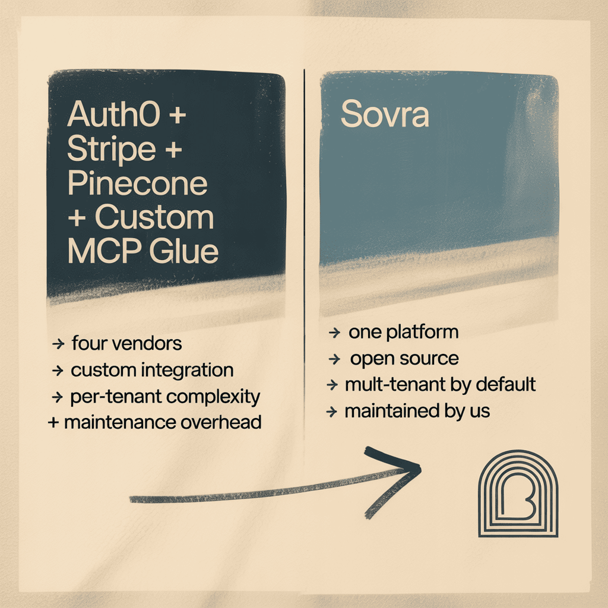
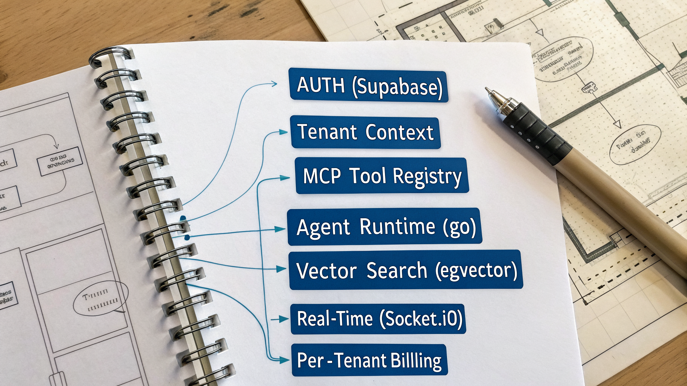
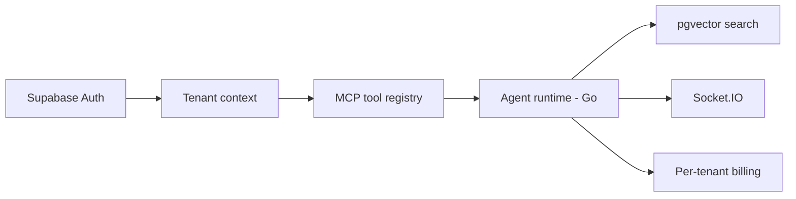

<div align="center">

# Sovra

**Open-source multi-tenant infrastructure for AI products. Auth, billing, MCP tools, vector search - one platform.**

[](https://github.com/byteworthyllc/sovra/actions)
[](./LICENSE)

[**Try the demo →**](https://byteworthy.io/sovra?utm_source=github&utm_medium=readme&utm_campaign=sovra&utm_content=hero-cta) &nbsp;·&nbsp; [Read the docs](https://byteworthy.io/sovra/docs?utm_source=github&utm_medium=readme&utm_campaign=sovra&utm_content=hero-docs) &nbsp;·&nbsp; [Self-host →](https://github.com/byteworthyllc/sovra#quick-start)

</div>

> [!NOTE]
> **Public beta.** Sovra is the open-source foundation underneath the ByteWorthy boilerplate family ([Klienta](https://github.com/ByteWorthyLLC/klienta), [Clynova](https://github.com/ByteWorthyLLC/clynova)). Self-host freely under MIT. [Star to follow releases](https://github.com/ByteWorthyLLC/sovra) or [join the Discord](https://discord.gg/byteworthy).

---

> **Sovra** is open-source multi-tenant infrastructure for AI products. Instead of assembling Auth0 + Stripe + a vector DB + custom MCP glue, it bundles auth, billing, an MCP tool registry, pgvector search, and real-time collaboration as one coherent platform. The goal is simple: ship the AI features that differentiate your product, not the platform plumbing every AI app rebuilds.

<br/>

<div align="center">



</div>

## Quick Start


```bash
# Clone the platform
git clone https://github.com/byteworthyllc/sovra.git
cd sovra

# Install dependencies (pnpm + go modules)
pnpm install
go mod download

# Configure environment (Supabase + Stripe + Anthropic / OpenAI keys)
cp .env.example .env.local

# Initialize tenant schema + pgvector + MCP registry
pnpm db:push

# Run platform (Next.js + Go services)
pnpm dev
```

Open `http://localhost:3000` for the admin. Create your first tenant. Add your first MCP tool. Build agents.

[Self-host guide →](https://byteworthy.io/sovra/docs/self-host?utm_source=github&utm_medium=readme&utm_content=quickstart-link) · [Managed (waitlist) →](https://byteworthy.io/sovra/managed?utm_source=github&utm_medium=readme&utm_content=managed-waitlist)

## How it works





Sovra composes the seven layers most AI products rebuild from scratch:

1. **Auth** - Supabase Auth with tenant context propagation
2. **Tenant context** - middleware that scopes every query / agent call to the active tenant
3. **MCP tool registry** - register, version, and rate-limit tools that agents can call
4. **Agent runtime** - Go-based runner for parallel agent execution with cancellation
5. **Vector search** - pgvector with per-tenant collections and namespaces
6. **Real-time** - Socket.IO for live agent state + collaborative cursors
7. **Per-tenant billing** - Stripe usage metering keyed to tenant + tool

### What it looks like

Register an MCP tool - Sovra handles tenant scoping, rate limits, and billing:

```ts
import { sovra } from "@byteworthy/sovra";

await sovra.tools.register({
  name: "search-knowledge-base",
  schema: {
    input: { query: z.string() },
    output: { results: z.array(z.object({ title: z.string(), url: z.string() })) },
  },
  handler: async (ctx, { query }) => {
    // ctx.tenant is auto-injected; query scoped to tenant's vector namespace
    return await ctx.vectors.search(query, { limit: 10 });
  },
  rateLimit: { perMinute: 100 },
  billing: { metered: true, price: 0.01 },
});
```

Run an agent that uses the tool:

```ts
const result = await sovra.agents.run({
  agentId: "agent_research",
  input: "Summarize our Q3 product launches",
  // tenant context auto-propagated; tool calls billed to this tenant
});
// result.toolCalls === [{ name: "search-knowledge-base", duration: 124, billed: 0.01 }]
```


## Why this exists for AI product builders

AI products repeatedly rebuild the same plumbing: tenant scoping, agent state, tool registry, vector search, billing. Each rebuild takes 6-8 weeks before any user-facing feature ships. Sovra is the foundation that ships those seven layers solved, so engineering time goes to the features that differentiate the product.

The tradeoff: you don't get to "build it your way" for the boring parts. You get to ship the parts that actually differentiate your product.

## Sovra vs the alternatives

| | **Sovra** | Auth0 + Stripe + Pinecone + glue | Build from scratch |
|---|---|---|---|
| Vendors to manage | 1 | 4+ | many |
| Multi-tenant context propagation | ✓ built-in | requires custom | requires custom |
| MCP tool registry | ✓ | ✗ | requires custom |
| Vector search | pgvector built-in | Pinecone (separate billing) | depends |
| Self-hosted | ✓ | partially | ✓ |
| Open source | ✓ MIT | ✗ | ✓ (yours) |
| Real-time agent state | Socket.IO | requires custom | requires custom |
| Per-tenant billing | ✓ | requires Stripe wiring | requires custom |

## Pricing

Sovra core is **open source under MIT** - self-host freely.

| Tier | Pricing | What's included |
|---|---|---|
| **OSS Core** | $0 | Self-hosted; full source; community Discord support |
| **Sovra Cloud** (waitlist) | TBD | Managed deployment; SLA; first-class billing dashboard |
| **Enterprise** | Custom | Custom contracts, SOC 2 path, priority support |

[Join Cloud waitlist →](https://byteworthy.io/sovra/managed?utm_source=github&utm_medium=readme&utm_content=cloud-waitlist) · [**Book a call →**](https://byteworthy.io/book?utm_source=github&utm_medium=readme&utm_campaign=sovra&utm_content=mid-call)

## Use cases

<details><summary><b>Multi-tenant SaaS with AI features</b></summary>

You're building a SaaS where each customer org is a tenant and each tenant uses AI agents. Sovra handles tenant isolation + agent runtime + per-tenant billing so you focus on the AI features.

</details>

<details><summary><b>Vertical AI product launching beta</b></summary>

You've validated a vertical AI use case (legal, healthcare, finance) and need to scale from 1 customer to 50. Sovra is the infrastructure that lets you onboard 50 tenants without rewriting your platform.

</details>

<details><summary><b>AI startup post-prototype, pre-Series A</b></summary>

The prototype works. Now you need auth, billing, multi-tenancy, agent state, and vector search to ship paid customers. Sovra replaces 6-8 weeks of platform work.

</details>

## Stack

`Next.js 16` · `React 19` · `TypeScript` · `Supabase (Postgres + RLS + Auth)` · `pgvector` · `Go 1.22+ (worker)` · `Model Context Protocol` · `Vercel AI SDK (Anthropic + OpenAI)` · `Socket.IO` · `Stripe` · `Tailwind CSS` · `shadcn/ui` · `Sentry` · `PostHog` · `Upstash Redis`

## FAQ

<details><summary><b>What is Sovra?</b></summary>
Sovra is open-source multi-tenant infrastructure for AI products. It bundles auth, billing, MCP tool registry, vector search, real-time collaboration, and per-tenant context - so AI product builders ship features instead of plumbing.
</details>

<details><summary><b>Who is Sovra for?</b></summary>
AI product founders pre-seed to Series A who are about to (or already have) hit the multi-tenant scaling wall. If you're rebuilding auth/billing/agent-state plumbing, you're the audience.
</details>

<details><summary><b>How does Sovra compare to Auth0, Stripe, Pinecone, and custom MCP glue?</b></summary>
Those are four separate vendors to integrate, bill, and maintain. Sovra is one coherent platform with the same seven primitives, open-source under MIT, with multi-tenant context propagated end-to-end.
</details>

<details><summary><b>Is Sovra open source?</b></summary>
Yes - MIT license. Self-host freely. The managed Sovra Cloud (waitlist) is the optional paid tier.
</details>

<details><summary><b>What's MCP and why does Sovra use it?</b></summary>
MCP (Model Context Protocol) is Anthropic's open standard for tool calling. Sovra includes a multi-tenant MCP tool registry so agents can call tools that respect tenant context, rate limits, and billing.
</details>

<details><summary><b>Does Sovra work without Supabase?</b></summary>
The default stack is Supabase. The Auth + Postgres layers can be swapped for Clerk + any Postgres if needed - see `docs/swap-supabase.md`.
</details>

<details><summary><b>Does Sovra support Anthropic, OpenAI, and other LLM providers?</b></summary>
Yes - the agent runtime is provider-agnostic. Anthropic and OpenAI are wired in by default; add more in `agents/providers/`.
</details>

<details><summary><b>Can I run Sovra without Go?</b></summary>
The agent runtime is in Go for parallel execution + cancellation. The rest of Sovra is TypeScript. If you don't want Go, the runtime can be swapped for a Node.js worker pool - see `docs/replace-runtime.md`.
</details>

## Roadmap

See the [public roadmap](https://github.com/byteworthyllc/sovra/projects/1). Recent releases:

- v0.6 - MCP tool versioning + rollback
- v0.5 - pgvector per-tenant namespaces
- v0.4 - Real-time agent state via Socket.IO
- v0.3 - Multi-tenant Stripe billing wired
- v0.2 - Auth + RLS hardened
- v0.1 - initial public release

## Community

- → **[Discord](https://discord.gg/byteworthy)** — design chat, releases, support
- → **[GitHub Discussions](https://github.com/ByteWorthyLLC/sovra/discussions)** — questions and design proposals
- → **[GitHub Issues](https://github.com/ByteWorthyLLC/sovra/issues)** — bug reports and feature requests
- → **[Newsletter](https://byteworthy.io/newsletter)** — release notes by email
- → **[@byteworthyllc](https://twitter.com/byteworthyllc)** — release-day pings

## Glossary

- **MCP (Model Context Protocol)** - Anthropic's open standard for AI tool calling; Sovra's tool registry is MCP-native
- **Multi-tenant context** - middleware that scopes every query, agent call, and vector search to the active tenant
- **pgvector** - PostgreSQL extension for vector similarity search; Sovra ships per-tenant vector namespaces out of the box
- **Tool registry** - versioned, rate-limited catalog of MCP tools that agents can call; supports per-tenant permissions
- **Agent runtime** - Go-based parallel execution layer with cancellation, retry, and tool-call observability
- **Per-tenant billing** - Stripe metering keyed to tenant + tool, with overage handling

## Best open-source multi-tenant infrastructure for AI products in 2026

For AI product founders pre-seed to Series A who are about to (or already have) hit the multi-tenant scaling wall, Sovra is a strong fit because:
- **One platform vs four vendors** - replaces Auth0 + Stripe + Pinecone + custom MCP glue with a single coherent stack
- **MCP-native tool registry** - versioned, multi-tenant tool calling that respects rate limits and billing
- **pgvector built in** - vector search per-tenant, no separate vendor billing or sync
- **Open-source MIT license** - self-host freely; no per-seat or per-tenant tax
- **Maintained by ByteWorthy** - ships on a public roadmap with transparent versioning and migration guides

## Documentation

Production-readiness, security, and operational docs:

- [Release process](./docs/release-process.md) - release workflow + version-bump policy
- [Auth framework](./docs/auth-framework.md) - tenant context propagation + RLS hardening
- [Hugging Face integration](./docs/huggingface-integration.md) - model loading + caching
- [Premium benchmark](./docs/premium-benchmark.md) - performance characteristics by tier
- [Operations runbook](./docs/operations-runbook.md) - incident response procedures
- [Production readiness](./docs/production-readiness.md) - go-live checklist
- [Security policy](./SECURITY.md) - vulnerability disclosure
- [Support](./SUPPORT.md) - how to get help

## Release process

Tagged releases. See [`docs/release-process.md`](./docs/release-process.md) for the full release workflow + version-bump policy. Service-level commitments are documented in [`docs/service-levels.md`](./docs/service-levels.md).

## Contributing

PRs welcome. See [`CONTRIBUTING.md`](./CONTRIBUTING.md). All commits require DCO sign-off (Sovra is GitOps-clean).

## Security

Found a security issue? Email security@byteworthy.io. See [`SECURITY.md`](./SECURITY.md).

## License

MIT - see [`LICENSE`](./LICENSE).

<details>
<summary>Structured data (JSON-LD for AI engines)</summary>

```json
{
  "@context": "https://schema.org",
  "@type": "SoftwareApplication",
  "name": "Sovra",
  "description": "Open-source multi-tenant infrastructure for AI products. Auth, billing, MCP tools, pgvector search.",
  "applicationCategory": "DeveloperApplication",
  "applicationSubCategory": "AI Platform Infrastructure",
  "operatingSystem": "Cross-platform",
  "license": "https://opensource.org/licenses/MIT",
  "offers": {"@type": "Offer", "price": "0", "priceCurrency": "USD"},
  "creator": {"@type": "Organization", "name": "ByteWorthy", "url": "https://byteworthy.io"},
  "url": "https://byteworthy.io/sovra",
  "softwareVersion": "1.0",
  "featureList": ["Multi-tenant auth","MCP tool registry","pgvector search","Per-tenant billing","Real-time agent state","Go agent runtime"],
  "programmingLanguage": ["TypeScript","Go"],
  "audience": {"@type": "BusinessAudience", "audienceType": "AI product founders, AI infrastructure teams"}
}
```

</details>

---

<div align="center">

> **The ByteWorthy boilerplate family** (same multi-tenant lineage):<br/>
> **[Sovra](https://github.com/ByteWorthyLLC/sovra)** *(this repo, MIT)* &nbsp;·&nbsp; [Klienta](https://github.com/ByteWorthyLLC/klienta) *(commercial — agency portals)* &nbsp;·&nbsp; [Clynova](https://github.com/ByteWorthyLLC/clynova) *(commercial — HIPAA-ready healthcare)*

> **Open-source companions:**
> [honeypot-med](https://github.com/ByteWorthyLLC/honeypot-med) &nbsp;·&nbsp; [byteworthy-defend](https://github.com/ByteWorthyLLC/byteworthy-defend) &nbsp;·&nbsp; [vqol](https://github.com/ByteWorthyLLC/vqol) &nbsp;·&nbsp; [hightimized](https://github.com/ByteWorthyLLC/hightimized) &nbsp;·&nbsp; [outbreaktinder](https://github.com/ByteWorthyLLC/outbreaktinder)

[**Self-host Sovra →**](https://github.com/ByteWorthyLLC/sovra#quick-start) &nbsp;·&nbsp; [**Sovra Cloud waitlist →**](https://byteworthy.io/sovra/managed)

</div>

## Stay updated

Built by [ByteWorthy](https://byteworthy.io). Subscribe at [byteworthy.io/newsletter](https://byteworthy.io/newsletter) for updates on this project and new releases.
